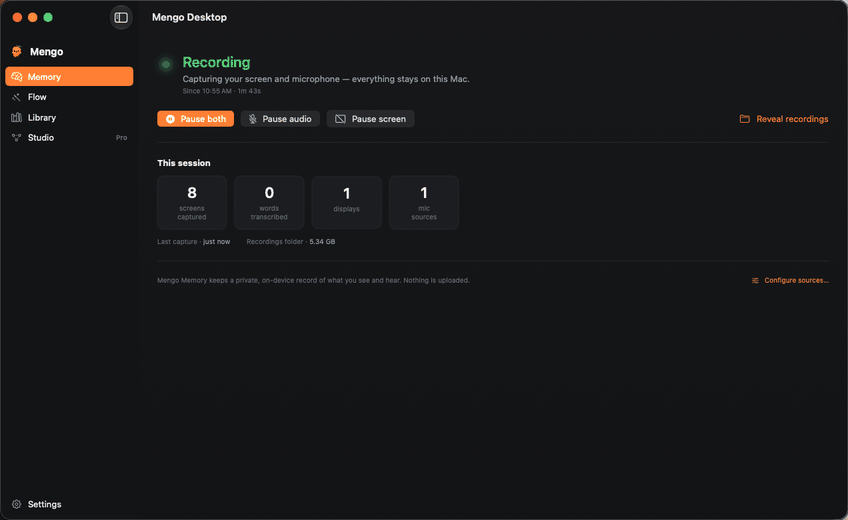

# Mengo Desktop

Mengo Desktop is an open-source macOS app for local AI memory and repeatable workflow capture. It runs [screenpipe](https://github.com/screenpipe/screenpipe) on your Mac, indexes recent screen/audio context locally, and helps turn a demonstrated task into a reusable agent skill.

Mengo is early V1 software. The core goal for this release is a reliable local loop:

1. record local screen/audio context,
2. search recent memory,
3. record a workflow while narrating it,
4. synthesize a skill with Codex or Claude Code,
5. review, edit, save, and reuse that skill.



## Status

Mengo Desktop is preparing for its first clean OSS V1 release. The app builds and the MengoDesktop test suite passes locally, but the public release checklist is still in progress. See [docs/release/mengo-desktop-v1-release-plan.md](docs/release/mengo-desktop-v1-release-plan.md) for the current release plan.

Known V1 gaps:

- Developer ID notarization is not finished; local builds are signed for development.
- Hosted Mengo account endpoints are optional in OSS preview builds; use local preview mode to run the app without a hosted account.
- Codex runtime support has passed scripted CLI/MCP smoke testing and a local in-app record-to-synthesize-to-review persistence smoke; the full clean-user manual matrix still needs to pass before Codex is advertised as the default path.
- Legacy ScreenpipeMenu and ScreenpipeFlow targets still exist in the repository while the V1 package is being cleaned up.

## Requirements

- macOS 15 Sequoia or later
- Apple Silicon for the current published preview artifact
- Xcode 16+ / Swift 6 when building from source
- A supported synthesis runtime:
  - Codex CLI, when using the Codex runtime
  - Claude Code CLI, when using the Claude Code runtime

Mengo uses the local screenpipe HTTP API on `http://127.0.0.1:3030`.

## Install

The current installer builds or downloads `MengoDesktop.app`, installs it to `~/Applications`, and launches it.

```bash
git clone https://github.com/klole/mengo-desktop.git
cd mengo-desktop
./install.sh
```

Then grant macOS permissions when prompted:

- Screen Recording
- Microphone

If the app is not notarized yet, macOS may require right-click -> Open for local preview builds.

## Local Preview Mode

Mengo Desktop V1 can run without hosted account setup.

From the sign-in screen, choose **Continue in local preview**. This creates a local Pro preview session with no hosted token, no billing, and no account-management handoff. Recording data and generated skills stay on this Mac.

For automated smoke tests, you can also launch with:

```bash
MENGO_PREVIEW_ACCOUNT=pro swift run MengoDesktop
MENGO_PREVIEW_ACCOUNT=free swift run MengoDesktop
```

`MENGO_DEV_ACCOUNT` remains accepted as a legacy alias for local testing.

## Build From Source

```bash
./bootstrap-cert.sh   # optional: creates a stable local development signing identity
./build-mengo.sh      # produces MengoDesktop.app and MengoDesktop-macos-$(uname -m).zip
```

For tests:

```bash
swift test
```

The preview zip is host-architecture-specific because the bundled screenpipe helper is distributed per architecture. The current published preview artifact is Apple Silicon (`MengoDesktop-macos-arm64.zip`). The x86_64 helper package exists upstream, and `build-mengo.sh` will select it on an Intel Mac, but Intel packaging remains unverified until it is built and smoke-tested on Intel hardware.

## Runtime Setup

Mengo Flow asks an agent runtime to convert a recorded workflow into a skill.

For Claude Code:

```bash
claude mcp add screenpipe -s user -- npx -y screenpipe-mcp
```

For Codex:

- Install the Codex CLI.
- Run `codex mcp add screenpipe -- npx -y screenpipe-mcp`.
- Select Codex in Mengo Settings.
- Complete the runtime preflight shown by the app.

Scripted Codex preflight:

```bash
scripts/smoke-codex-runtime.sh
MENGO_CODEX_SMOKE_RUN_MODEL=1 scripts/smoke-codex-runtime.sh
MENGO_CODEX_SMOKE_NEGATIVE=missing-mcp scripts/smoke-codex-runtime.sh
```

The runtime receives the synthesis prompt and access to local screenpipe context through the configured MCP path. Review the generated skill before saving it.

## What Mengo Records

Mengo starts a bundled screenpipe helper that can capture:

- screen frames and OCR,
- microphone audio and transcription,
- app/window metadata exposed by macOS,
- local accessibility context where available.

Data is stored locally by screenpipe, normally under `~/.screenpipe`. Generated skills are written to the skills directory used by the selected runtime, currently `~/.claude/skills` for the Claude-compatible skill flow.

No recording data is intentionally uploaded by Mengo itself. When you synthesize a skill, the selected runtime may receive prompt/context data according to that runtime's configuration. Treat recordings as sensitive local data.

## Repository Layout

- `Sources/MengoDesktop` - main app
- `Tests/MengoDesktopTests` - main app tests
- `Resources/MengoDesktopInfo.plist` - app bundle metadata
- `build-mengo.sh` - release bundle builder
- `docs/manual-smoke-tests` - manual QA scripts
- `docs/release` - release planning and gates
- `Sources/ScreenpipeMenu`, `Sources/ScreenpipeFlow` - legacy targets retained during V1 cleanup

## Troubleshooting

Recorder does not start:

- Confirm Screen Recording and Microphone permissions are granted to Mengo Desktop.
- Quit and relaunch the app after changing macOS privacy settings.
- Check `~/Library/Logs/MengoDesktop/recorder.log`.

Runtime synthesis fails:

- Confirm the selected runtime executable is installed.
- Confirm screenpipe MCP setup for that runtime.
- Confirm the skills output directory is writable.

Account screen appears:

- Click **Continue in local preview** for OSS preview use.
- Hosted sign-in depends on `mengo.ai` account endpoints and is not required for local preview.

Build fails:

- Confirm Xcode 16+ is selected with `xcode-select -p`.
- Run `swift --version` and confirm Swift 6+.
- Remove stale local artifacts with `rm -rf .build MengoDesktop.app MengoDesktop-macos-*.zip`.

## Contributing

See [CONTRIBUTING.md](CONTRIBUTING.md). The highest-priority V1 work is tracked in [docs/release/mengo-desktop-v1-release-plan.md](docs/release/mengo-desktop-v1-release-plan.md).

## Security

Please do not file public issues for vulnerabilities or privacy-sensitive recorder behavior. See [SECURITY.md](SECURITY.md).

## License

MIT. See [LICENSE](LICENSE).

Mengo Desktop is not affiliated with the upstream screenpipe project.
